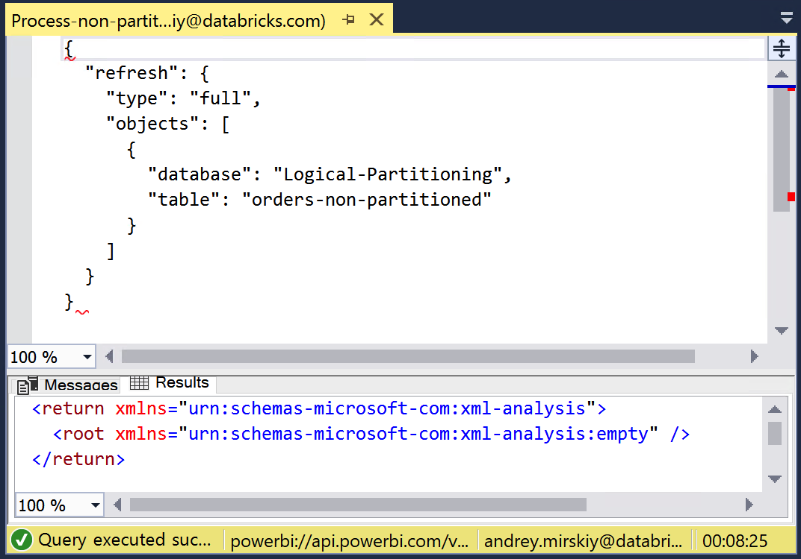
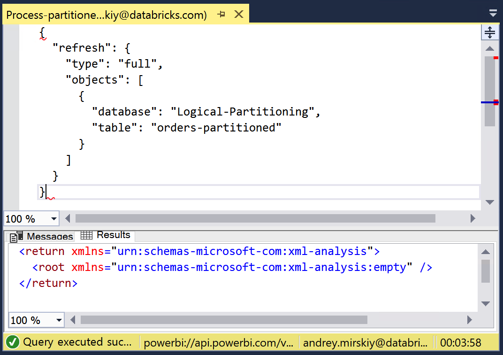

# Logical Partitioning
## Introduction
[Logical Partitioning](https://learn.microsoft.com/en-us/analysis-services/tabular-models/create-and-manage-tabular-model-partitions?view=asallproducts-allversions) is important feature of Power BI which help in improving the refresh time of Power Bi datasets. In this report we will showcase and compare how Logical Partitioning will allow a faster & reliable refresh of new data simply because with partitions you can divide the table data into logical parts that can be managed & refreshed individually. You can follow the steps mentioned in the [Step by Step Instructions](#step-by-step-instructions) section.

## Pre-requisites

Before you begin, ensure you have the following:

- [Databricks account](https://databricks.com/) and access to a Databricks workspace and also have DBSQL warehouse set up 
- [Power BI Desktop](https://powerbi.microsoft.com/desktop/) installed on your machine.
- Power BI **Premium** workspace
- DAX Studio
- Tabular Editor
  
## Step by Step Instructions
1. We have an initial Power BI dataset which is based on **samples** catalog, **tpch** schema. There is only one fact table **orders** which is set to Import mode.
2. Next we created a copy of the orders table and renamed it as **orders-non-partitioned**. The create [non partitioned table script](./Create-non-partitioned-table.xmla) is also avaiable in this repo . As shown below you can use DAX Studio to view the default partitions :
3. Next we create another copy of orders table and name it as **orders-partitioned**.The create [partitioned table script](./Create-partitioned-table.xmla) is also avaiable in this repo . We use Tabular Editor to create logical partition. [This](https://www.youtube.com/watch?v=6CRqdsLjHNA) video showcases how you can create logical parititons.In our example we have created these partitions based on the **order priority type** . As shown below in DAX Studio screen shot , 5 parittions are created based onb order priority type and every parittion has it's own data:

4. To showcase the execution time difference we process both the **orders-partitioned** and **orders-non-partitioned**. As shown in the screenshots below , non paritioned tables process **~7.5M** records in default paritition in **8min25sec** whereas parititioned table finishes processing the same **~7.5M** records in just under **4min** . 
   
**orders-non-partitioned**

**orders-partitioned**

As when you refresh logical paritions ,every paritition divides the data based on the partition type and now rather than 1 partition processing entire dataset parallelism is introduced and multiple parallel queries running each partitions data is run against DBSQl therby giving **~50%** improvement in processing times

## Power BI Template 

A sample Power BI template [Logical-Partitioning.pbit](./Logical-Partitioning.pbit) is present in the current folder. When opening the template, enter respective **ServerHostname** and **HTTP Path** values of your Databricks SQL Warehouse. The template uses tpch catalog, therefore you don't need to prepare any additional data for this report.
