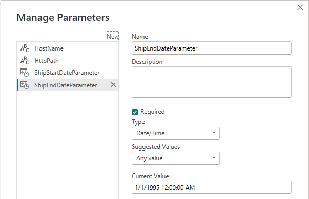
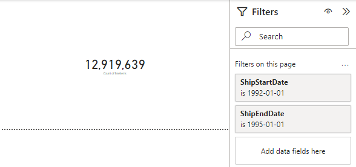

# Dynamic M Query Parameters

## Introduction
As per Microsoft [documenation](!https://learn.microsoft.com/en-us/power-bi/connect-data/desktop-dynamic-m-query-parameters), With dynamic M query parameters, model authors can configure the filter or slicer values that report viewers can use for an M query parameter. Dynamic M query parameters give model authors more control over the filter selections to incorporate into DirectQuery source queries. With dynamic M query parameters, model authors can ensure that filter selections incorporate into source queries at the right point to achieve the intended results with optimum performance. Dynamic M query parameters can be especially useful for query performance optimization.

## Pre-requisites
1. Databricks workspace.
2. Databricks SQL Warehouse.
3. Power BI Desktop, latest version is recommended.

## Step by Step Walkthrough
1. We have an initial Power BI dataset which is based on **samples** catalog, **tpch** schema. There is only one fact table **lineitem** which is set to **Direct Query** mode.
2. Next, in the Power Query Editor, we define 2 parameters - **ShipStartDateParameter** and **ShipEndDateParameter** - which we will use to filter data in the fact table.

    

3. Next we adjust M-query for **lineitem** table as follows. Here we add an extra operation to filter the records based on **l_shipdate** column and **ShipStartDateParameter**/**ShipEndDateParameter** parameter values.
    ```
    let
        Source = Databricks.Catalogs(HostName, HttpPath, [Catalog=null, Database=null, EnableAutomaticProxyDiscovery=null]),
        samples_Database = Source{[Name="samples",Kind="Database"]}[Data],
        tpch_Schema = samples_Database{[Name="tpch",Kind="Schema"]}[Data],
        lineitem_Table = tpch_Schema{[Name="lineitem",Kind="Table"]}[Data],
        #"Changed Type" = Table.TransformColumnTypes(lineitem_Table,{{"l_shipdate", type datetime}}),
        #"Filtered Rows" = Table.SelectRows(#"Changed Type", each [l_shipdate] >= ShipStartDateParameter and [l_shipdate] <= ShipEndDateParameter)
    in
        #"Filtered Rows"
    ```
4. Next we need to create 2 tables for each parameter which contain possible values available to be dynamically set based on filter selection. You can use a query to a data source to create such tabler. Alternatively you can define them as calculated tables. 
    ```
    ShipStartDates = CALENDAR("1/1/1992", "31/12/1998")
    ShipEndDates = CALENDAR("1/1/1992", "31/12/1998")
    ```
5. At the next step we bind previously created parameters to the columns in date tables.
    - ShipStartDateParameter --> ShipStartDates.ShipStartDate
    - ShipEndDateParameter --> ShipEndDates.ShipEndDate
    
6. Finally, we can build a sample report and filter data based on **ShipStartDate** and **ShipEndDate** columns.


    The report generates the following SQL-query.
    ```sql
    select
    count(1) as `C1`
    from
    (
        select
        ...
        `C1`
        from
        (
            select
            ...
            cast(`l_shipdate` as TIMESTAMP) as `C1`
            from
            `samples`.`tpch`.`lineitem`
        ) as `ITBL`
        where
        `C1` >= { ts '1992-01-01 00:00:00' }
        and `C1` <= { ts '1995-01-01 00:00:00' }
    ) as `ITBL`
    ```


## Conclusion
With this simple technique you can have a better control over the filter selections to incorporate into DirectQuery source queries. Dynamic M query parameters can be especially useful for query performance optimization.
More details can be found in Microsoft documentation - [Dynamic M query parameters in Power BI Desktop](!https://learn.microsoft.com/en-us/power-bi/connect-data/desktop-dynamic-m-query-parameters).


## Power BI Template 
A sample Power BI template [Dynamic_M_Query_Parameters.pbit](./Dynamic_M_Query_Parameters.pbit) is present in the current folder. When opening the template, enter respective **ServerHostname** and **HTTP Path** values of your Databricks SQL Warehouse. The template uses **samples** catalog, therefore you don't need to prepare any additional data for this report.
